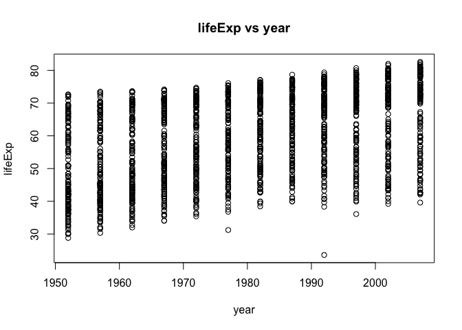
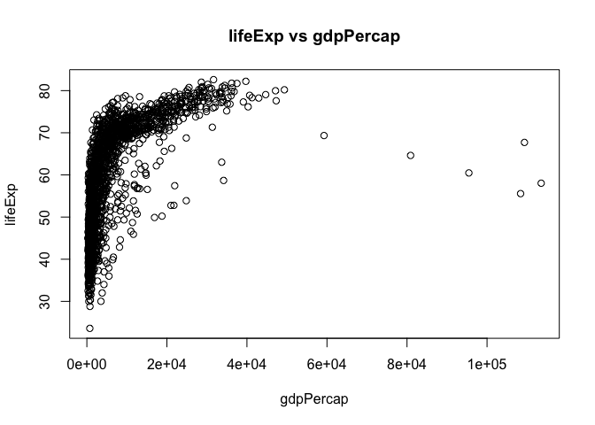
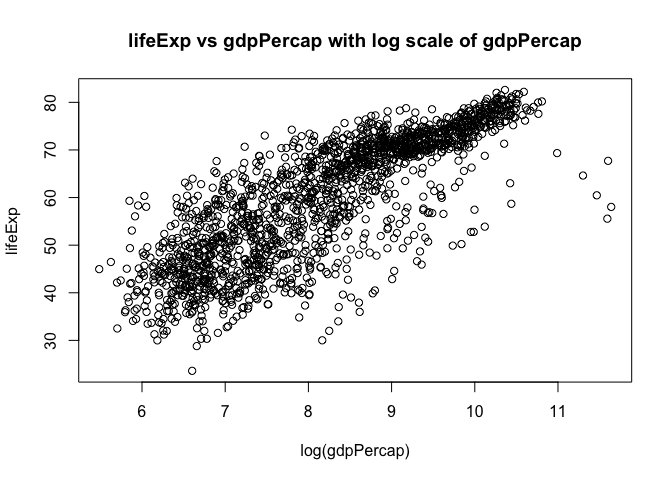
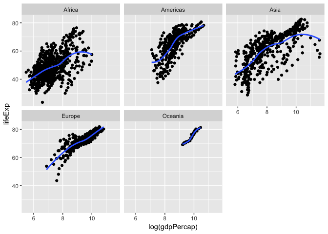
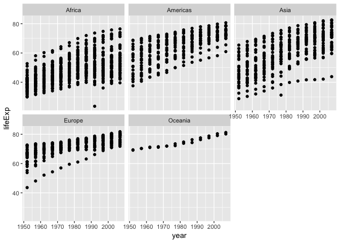

Hw1-gapminder
================
September 12, 2017

## Gapminder Dataset

``` r
library(gapminder)
library(tidyverse)
```

Below is gapminder dataset based on UN statistics in different
countries.

``` r
gapminder
```

    ## # A tibble: 1,704 x 6
    ##    country     continent  year lifeExp      pop gdpPercap
    ##    <fct>       <fct>     <int>   <dbl>    <int>     <dbl>
    ##  1 Afghanistan Asia       1952    28.8  8425333      779.
    ##  2 Afghanistan Asia       1957    30.3  9240934      821.
    ##  3 Afghanistan Asia       1962    32.0 10267083      853.
    ##  4 Afghanistan Asia       1967    34.0 11537966      836.
    ##  5 Afghanistan Asia       1972    36.1 13079460      740.
    ##  6 Afghanistan Asia       1977    38.4 14880372      786.
    ##  7 Afghanistan Asia       1982    39.9 12881816      978.
    ##  8 Afghanistan Asia       1987    40.8 13867957      852.
    ##  9 Afghanistan Asia       1992    41.7 16317921      649.
    ## 10 Afghanistan Asia       1997    41.8 22227415      635.
    ## # ... with 1,694 more rows

``` r
head(gapminder)
```

    ## # A tibble: 6 x 6
    ##   country     continent  year lifeExp      pop gdpPercap
    ##   <fct>       <fct>     <int>   <dbl>    <int>     <dbl>
    ## 1 Afghanistan Asia       1952    28.8  8425333      779.
    ## 2 Afghanistan Asia       1957    30.3  9240934      821.
    ## 3 Afghanistan Asia       1962    32.0 10267083      853.
    ## 4 Afghanistan Asia       1967    34.0 11537966      836.
    ## 5 Afghanistan Asia       1972    36.1 13079460      740.
    ## 6 Afghanistan Asia       1977    38.4 14880372      786.

``` r
tail(gapminder)
```

    ## # A tibble: 6 x 6
    ##   country  continent  year lifeExp      pop gdpPercap
    ##   <fct>    <fct>     <int>   <dbl>    <int>     <dbl>
    ## 1 Zimbabwe Africa     1982    60.4  7636524      789.
    ## 2 Zimbabwe Africa     1987    62.4  9216418      706.
    ## 3 Zimbabwe Africa     1992    60.4 10704340      693.
    ## 4 Zimbabwe Africa     1997    46.8 11404948      792.
    ## 5 Zimbabwe Africa     2002    40.0 11926563      672.
    ## 6 Zimbabwe Africa     2007    43.5 12311143      470.

``` r
summary(gapminder)
```

    ##         country        continent        year         lifeExp     
    ##  Afghanistan:  12   Africa  :624   Min.   :1952   Min.   :23.60  
    ##  Albania    :  12   Americas:300   1st Qu.:1966   1st Qu.:48.20  
    ##  Algeria    :  12   Asia    :396   Median :1980   Median :60.71  
    ##  Angola     :  12   Europe  :360   Mean   :1980   Mean   :59.47  
    ##  Argentina  :  12   Oceania : 24   3rd Qu.:1993   3rd Qu.:70.85  
    ##  Australia  :  12                  Max.   :2007   Max.   :82.60  
    ##  (Other)    :1632                                                
    ##       pop              gdpPercap       
    ##  Min.   :6.001e+04   Min.   :   241.2  
    ##  1st Qu.:2.794e+06   1st Qu.:  1202.1  
    ##  Median :7.024e+06   Median :  3531.8  
    ##  Mean   :2.960e+07   Mean   :  7215.3  
    ##  3rd Qu.:1.959e+07   3rd Qu.:  9325.5  
    ##  Max.   :1.319e+09   Max.   :113523.1  
    ## 

## LifeExp, Pop and gdpPercap Information

Below is lifeExp, pop and gdpPercap information between year 1952 and
year 2007

``` r
summary(gapminder$lifeExp)
```

    ##    Min. 1st Qu.  Median    Mean 3rd Qu.    Max. 
    ##   23.60   48.20   60.71   59.47   70.85   82.60

``` r
summary(gapminder$pop)
```

    ##      Min.   1st Qu.    Median      Mean   3rd Qu.      Max. 
    ## 6.001e+04 2.794e+06 7.024e+06 2.960e+07 1.959e+07 1.319e+09

``` r
summary(gapminder$gdpPercap)
```

    ##     Min.  1st Qu.   Median     Mean  3rd Qu.     Max. 
    ##    241.2   1202.1   3531.8   7215.3   9325.5 113523.1

## Making some plots

Here is a plot of lifeExp vs year based on UN statistics from year 1952
to 2007

<!-- -->

Here is a plot of lifeExp vs gdpPercap based on UN statistics from year
1952 to 2007, we can see the correlation between lifeExp and economy

<!-- -->

Below is a plot of lifeExp vs gdpPercap by using a log scale plot of
gdpPercap.

<!-- -->

After log scaling, we can find that there is a linear relationship
between lifeExp and gapPercap, showing that people in rich countries
have long lifeExp.

Next, we will plot lifeExp vs gdpPercap on diffrent continents

    ## `geom_smooth()` using method = 'loess' and formula 'y ~ x'

<!-- -->

Finally, a plot of lifeExp vs year on different continents is shown
below

<!-- -->
